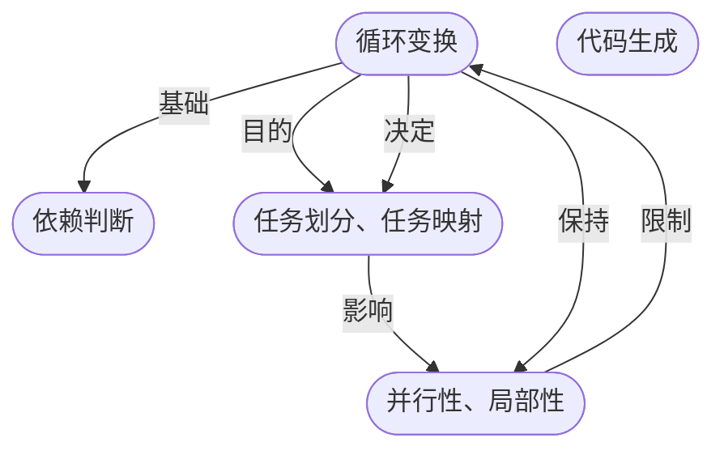

编译技术的重点：中间过程的<u>程序优化</u>，后端<u>代码的生成</u>

多面体模型：

+ 研究对象：循环嵌套
+ 应用场景：依赖分析，并行性和局部性发掘

编译器职责：

+ 代码优化
+ 弥合上层编程模型与底层硬件的鸿沟
	+ 架构演化 -> 编译技术

## 面向经典体系结构的性能优化
方法：

+ 并行性发掘
	+ 分类：
		+ 数据级并行：同时操作多个数据
		+ 任务级并行：并行运行独立任务
	+ 实现：
		+ 指令级并行：流水线(时间)、多发射(空间)、同时多线程、超长指令字(时空间)
		+ 单指令多数据并行(空间)：向量单元
		+ 线程级并行：不同PE的指令流相互独立(同步/异步)
			+ 核内：硬件多线程；核间：众核
			+ 实现：对称多处理器(SMP), 分布式共享存储(DSM), 大规模并行处理器(MPP), 集群(cluster)
		+ 请求级并行：多指令多数据MIMD并行
			+ 粗粒度，依赖操作系统
+ 存储层次结构：
	+ 常规架构：
		+ 私有L1, 组共享L2, 共享L3
		+ 金字塔形，不同层次存储器只与相邻的上下层存储器交换数据；数据一致性由协议保证
	+ 分类：
		+ Cache: 硬件自动管理存储，自动维护一致性
		+ 便签式存储器(scratchpad memory): 软件自主管理存储，手动维护一致性
+ 领域专用架构：根据应用的具体特点，定制运算单元(算力配置)，简化控制逻辑，设计与计算模式匹配的存储结构和数据通路(带宽配置，互联结构)
	+ 特点：计算密集，访存密集

> [!note] Stencil运算
> 特点：输入输出数据组织成一个多维网络，一个输出数据点的值只与邻近点的输入点有关，依赖关系复杂
> 
> 优化方向：计算次序，数据布局(局部性，并行性)

## 编译器面临的挑战
体系结构设计与编译的关系：体系结构设计确定软件的执行平台，编译器需在确定的执行平台上优化程序

程序优化：

+ 概念：
	+ 狭义：尽可能发掘程序的并行性和硬件的计算能力，使得代码在具体硬件上的执行速度达到最高
	+ 广义：为了改进应用程序的某项指标(执行时间、代码尺寸和内存占用)，在不改变程序语义的前提下，修改其内部数据结构或所生成代码的过程
+ 分类：架构相关，架构无关
+ 步骤：程序分析、代码优化、代码生成

### 并行性发掘
思路：结合硬件的结构特点，通过<u>指令调度</u>的方法提高硬件资源<u>利用率</u>

方法：

+ 静态分支预测
+ 延迟槽调度
+ 静态指令调度
+ 循环展开
+ 软件流水

循环级优化：单指令多数据并行和线程级优化通常以循环为研究对象

+ 目标：减少延迟、提高吞吐率
+ 方法：
	+ 循环展开：避免循环的控制开销
	+ 软流水：重新组合原始循环，将无依赖的访存和计算指令组合在一个循环迭代中
	+ 并行化：循环划分，最小化处理器间通信量
		+ 通常在外部循环进行
	+ 向量化：标量运算 -> 向量运算
		+ 通常在内部循环进行
+ 问题：<u>并行化和向量化是两个相互冲突的优化目标</u>
	+ 难点：并行性识别、循环变换

### 局部性发掘
方法：

+ 循环分块：将大块循环迭代拆解成若干较小的循环迭代，<u>减少数据重用周期</u>
+ 循环融合：将具有“生产-消费”关系的循环合并在一起，<u>缩短中间数据的重用周期</u>，避免中间数据被换出

问题：<u>分块和融合是两个相互冲突的优化目标</u>(融合导致分块约束增加)
### 编程模型和抽象层次
编程模型：体系结构与应用算法的桥梁

+ 设计要点：平衡通用性和领域专用性
	+ 编程模型的抽象层次越高，对底层体系结构信息隐藏越多，对特定领域的性能越不易保证

多级抽象：在多种编译抽象层次上进行优化

+ 例：计算图级别(计算图融合、调度), 算子级别(并行性、局部性), 指令级别优化
	+ 多面体模型抽象层次介于指令级和计算图级别(<u>张量计算的循环优化</u>)

## 循环优化的数学抽象
事实：大多数张量应用程序核心部分是N重嵌套循环

循环优化研究方向：

+ 依赖判断
+ 循环变化
+ 任务划分
+ 任务映射
+ 并行性、局部性优化
+ 代码生成

关系：


观察：

+ N重嵌套循环的上界和下界表达式通常是<u>仿射表达式</u>
+ 循环体内的多维数组下标通常是循环变量的<u>仿射表达式</u>

结论：在假设循环约束及数组下标均为仿射表达式的前提下，依赖判断、循环变换、任务划分、任务映射、并行性和局部性优化可以<u>统一使用仿射关系</u>来描述(即多面体理论)
### 多面体模型
理论支撑：线性代数、线性规划、集合论、数理逻辑、最优化理论

抽象：

1. 迭代空间抽象：N重嵌套循环 -> N维迭代空间
	+ **迭代空间**：N重嵌套循环中各个索引变量的取值集合
		+ **约束集合**：循环上界、循环下界的线性约束集合
		+ **合法迭代向量**：满足约束的N维(索引变量)向量
	+ 迭代空间的构造：
		+ 定义：满足循环约束的N维子空间
		+ 核心：确定每一重循环的上下界
		+ 步骤：
			1. 对循环进行等价变换：变换为<u>只有一个循环索引变量</u>，且循环索引变量<u>步长为1</u>
				+ 保守处理：对于编译时无法确定上下界，认为无法确定的上/下界为$+/-\infty$
					+ 依赖全局不变符号表达式时，不做保守处理
				+ 仿射变换：下界为a, 步长为d: 引入辅助索引变量$i', i\to d\cdot i'+a$
			2. 由循环迭代变量和循环上下界构成的<u>线性不等式组</u>构成N维迭代空间约束集合，将约束记作
			$$
			S=\set{i\in \mathbb Z^N:\mathbf Bi+\mathbf d\geqslant\mathbf 0}
			$$

> [!important] 迭代空间无序
> 迭代空间是整数集，整数集描述的迭代域并不隐含语句的实际执行顺序，实际执行顺序由调度表示

> [!note] 多面体
> 仿射方程组$\mathbf Mx+c=0$表示N维仿射空间的一个超平面(N-1维仿射子空间)
> 
> + 证明：线性映射基本定理：$\because \sigma_M:\mathbb Z^N\to\mathbb Z \therefore N(\sigma_M)=N-r(\sigma_M)=N-1$
> 
> 半空间：一个超平面将N维仿射空间划分为两部分，每一部分与该超平面一起构成半空间，记作$\mathbf Mx+c\geqslant 0$
> 
> 多面体：多个半空间的交
> 
> 凸多面体：$S=\set{i\in \mathbb Z^N:\mathbf Bi+\mathbf d\geqslant\mathbf 0}$
> 
> + 性质：
> 	+ 满足约束的任意两点的连线位于凸多面体内部
> 	+ 凸多面体中任意一个整数点都是一个合法的循环迭代向量
> 	+ 凸多面体在任意维度的投影对应该维度的循环上下界
> + Presburger表示：$S=\set{(i,j):0\leqslant i<R\land0\leqslant j<C}$
> 	+ 近似仿射表达式：在仿射约束的基础上增加rem, floordiv, ceildiv, max, min
> 
> 模型要求：循环索引变量的上下界表达式必须是由符号<u>常量</u>或外层循环索引变量构成的**近似仿射表达式**
	
2. 语句实例抽象：静态语句 + 循环迭代向量 => 动态语句实例
	+ **动态语句实例**：N重嵌套循环中的静态语句与循环迭代向量的组合
		+ 表示：设静态语句S，N重嵌套循环迭代向量i，则动态访问实例可表为$S(i)$
3. 数据空间抽象：M维数组 => M维数据空间
	+ **数据访问关系**：迭代空间中的任意迭代向量 + 数据访问关系 -> 数据空间某一具体位置
		+ **仿射访问函数**：N维迭代向量 -> M维数据空间
			+ 动态语句实例$S(i)$对张量$A$的读操作：$R_{S,A}(i)$, 写操作：$W_{S,A}(i)$
				+ 例：$R_{S,A}(i,j)=\set{S(i,j)\to A(i):0\leqslant i<R\land0\leqslant j<C}$
			+ 矩阵形式：$\sigma(i)=\mathbf Fi+\mathbf f, \mathbf F\in \mathbb Z^{M\times N},\ \mathbf f\in \mathbb Z^M$
		+ 应用：
			+ 确定数据访问的局部性
			+ 使用多个仿射访问关系的并集描述完整的访问函数
4. 处理器空间抽象：可并行工作的计算单元 => K维处理器空间
	+ 每个处理器具有唯一整数标识
	+ <u>循环划分</u>与<u>循环调度</u>解偶：
		+ 初始时假设处理器空间维度和迭代空间相同，且每个维度有无限个处理器：不存在依赖关系的循环迭代可以在<u>虚拟处理器空间</u>中实现完全并行
		+ 完成依赖分析和循环调度后，使用简单的<u>处理器分配</u>算法将虚拟处理器映射到物理处理器
		+ 赋予原先虚拟处理器空间中完全并行的循环迭代以确定的<u>执行顺序</u>
5. 依赖关系抽象：<u>动态语句实例之间</u>的依赖关系 = 数据空间<u>读写顺序约束</u>
	+ 数据空间访问关系分类：<u>读访问，写访问</u>
6. 调度抽象：动态语句实例 => 多维执行时间
	+ **执行顺序**：使用多维时间<u>字典序</u>指定动态语句实例执行顺序；每种可行的执行顺序称作一种**调度**
		+ 初始调度：原始程序对应的串行执行顺序(循环展开：由外到内排列循环下标变量)
		+ 字典序：$i=(i_0,\cdots,i_n),i'=(i_0',\cdots,i_n'),i<i'\Leftrightarrow\exists m<\min(n,m')\ s.t.(i_0,\cdots,i_m)=(i_0',\cdots,i_m'),i_{m+1}<i_{m+1}'$
	+ 应用：循环并行性和局部性的优化是通过对调度进行一系列的变换实现的
		+ 合法调度变换：不破坏原有程序语义中的数据依赖的调度变换
		+ 问题：不同执行顺序性能不同，从<u>可行的执行顺序中选择最优执行顺序</u>

定义：基于上述抽象模型的编译优化方法称作多面体优化

方法：将循环优化问题转换成<u>多维空间和空间之间的仿射映射</u>，以使用数学解决循环<u>并行性和局部性</u>优化问题

+ 循环变换 -> 最优化问题：选择合适的<u>映射关系</u>，将迭代空间的每个语句映射到特定的<u>执行时间</u>或<u>处理单元</u>上，使整个程序在<u>维持原始循环的串行语义</u>的前提下，尽可能高效执行
+ 并行性：线程级并行、向量化挖掘数据并行(非任务并行)
+ 局部性：减少数据传输开销

### 基于多面体模型的编译流程
1. 依赖分析：确定程序中所有数据相关性的过程
	+ **依赖关系**类型：读后写、写后写、写后读
		+ 存在依赖的<u>循环迭代</u>不能并行或改变顺序，不存在依赖的可以以任意顺序执行
	+ **相关性测试**：确定循环嵌套中对同一个数组的两个或多个下标引用之间是否存在相关性的方法
		+ 方法：在<u>限定访问函数为仿射函数</u>的前提下，可利用整数线性规划相关方法来确定两个迭代是否存在依赖关系
			+ 数据依赖判定 -> 整数线性规划(存在性问题, ==NP完全==)：满足一系列约束的前提下，是否存在整数解
		+ 访问关系与数据依赖：
			+ 所有读操作之间没有依赖
			+ 两操作存在数据依赖的充要条件：<u>两操作访问同一个存储位置，且至少有一个是写操作</u>
			+ 推论：为了保持数据依赖，所有写操作都必须维持原始顺序(同一位置的两个写操作可任意顺序执行)
	+ 应用：不存在数据依赖的语句可进行重拍序(局部性)，或映射到不同处理单元并行执行(并行性)，或二者trade off

> [!example] 写后读依赖
> ```c
> for (i1 = L1; i1 < U1; i1++)
> 	for (i2 = L2; i2 < U2; i2++)
> 		// ...
> 			for (in = Ln; in < Un; in++) {
> 				A(f1(i1, ..., in), ..., fm(i1, ..., in)) = ...; // S1
> 				... = A(g1(i1, ..., in), ..., gm(i1, ..., in)); // S2
> 			}
> ```
> $S_1, S_2$存在依赖$\Leftrightarrow \exists\alpha,\beta,\alpha\preccurlyeq\beta,s.t.\ f_i(\alpha)=g_i(\beta),\forall i, 1\leqslant i\leqslant m$
> 
> + $\Leftarrow$: 在同一次迭代内，由于$S_2$读操作发生在$S_1$写操作之后，只要$A(\vec g(\beta))$在$A(\vec f(\alpha))$之后访问，$A(\vec f(\alpha))$的数据就会发生<u>复用</u>，即$S_2$与$S_1$存在依赖关系
> + $\Rightarrow$: $S_1, S_2$存在依赖，$S_2$应保持在$S_1$后执行

> [!note] 访问关系依赖分析
> 对于访问关系$\mathbf F_1i_1+\mathbf f_1,\mathbf F_2i_2+\mathbf f_2$，已知至少一个是写操作，存在依赖的必要不充分条件为$\exists i_1,i_2\ s.t.\ \mathbf F_1i_1+\mathbf f_1=\mathbf F_2i_2+\mathbf f_2(*)$ (不充分：未对$i_1, i_2$的序做限定)
> 
> 同一迭代内：
> 
> 1. $i_1=i_2, \mathbf F_1=\mathbf F_2, \mathbf f_1=f_2$: $(*)$恒成立，一定存在依赖
> 2. $i_1=i_2, \mathbf F_1\not=\mathbf F_2, \mathbf f_1=f_2$: $(*)$有解$\Leftrightarrow(\mathbf F_1-\mathbf F_2)i_1=0$, 存在依赖的必要条件为$(\mathbf F_1-\mathbf F_2)i_1=0$有解
> 3. $i_1=i_2, \mathbf F_1=\mathbf F_2, \mathbf f_1\not=f_2$: $(*)$无解，一定不存在依赖
> 4. $i_1=i_2, \mathbf F_1\not=\mathbf F_2, \mathbf f_1\not=f_2$: 存在依赖的必要条件为$(\mathbf F_1-\mathbf F_2)i_1=f_2-f_1$有解
> 
> 不同迭代间：
> 
> 1. $i_1\not=i_2, \mathbf F_1=\mathbf F_2, \mathbf f_1=f_2$: 存在依赖的必要条件为$\mathbf F_1(i_1-i_2)=0$有解
> 	+ 当$r(F)=N$时，$M\geqslant N, i_1-i_2=0$，无解，不存在依赖
> 2. $i_1\not=i_2, \mathbf F_1\not=\mathbf F_2, \mathbf f_1=f_2$: 存在依赖的必要条件为$\mathbf F_1i_1=\mathbf F_2i_2$有解
> 3. $i_1\not=i_2, \mathbf F_1=\mathbf F_2, \mathbf f_1\not=f_2$: 存在依赖的必要条件为$\mathbf F_1(i_1-i_2)=\mathbf f_2-\mathbf f_1$有解
> 4. $i_1\not=i_2, \mathbf F_1\not=\mathbf F_2, \mathbf f_1\not=f_2$: 存在依赖的必要条件为$\mathbf F_1i_1+\mathbf f_1=\mathbf F_2i_2+\mathbf f_2$有解

> [!info] doall VS doacross循环
> doall循环：没有依赖的嵌套循环
> 
> doacross循环：有依赖的循环

2. 循环变换：实现并行性、局部性发掘的核心手段
	+ **并行度**：N层循环嵌套结构有K个可并行化(没有依赖关系)的循环，则称该循环的并行度为K
		+ 对于并行度为K的N层嵌套循环，可在一个PE上以<u>任意顺序</u>遍历K维子迭代空间，或将K维子空间映射到处理器阵列上<u>并行处理</u>
	+ 方法：仿射变换<u>分解</u>，仿射变换 <-> 源代码修改
	+ 基础仿射变换：
		1. 循环交换：交换内外层循环
		2. 循环反转：按相反顺序执行某层迭代
		3. 循环倾斜：对迭代空间进行坐标变换
		4. 循环延展：循环索引变量、迭代空间等比例缩放
		5. 循环合并：多个循环下标 -> 同一个循环下标
		6. 循环分裂：不同语句同一个循环下标 -> 不同循环下标
		7. 循环偏移：将动态语句实例移动常数个循环迭代
	+ **幺模变换**：可以用幺模矩阵表示的变换(变换a, b, c)
		+ 幺模矩阵：行列式为$\pm1$的方阵(用于循环变换的幺模矩阵<u>所有元素为整数</u>)
			+ 性质：幺模矩阵的乘积和逆矩阵仍为幺模矩阵
		+ 应用：将N维迭代空间映射到另一个N维多面体
			+ 可用于描述任何基于循环交换、循环倾斜和循环反转构成的复杂变换
			+ 最终的变换矩阵即将各种基本循环变换矩阵相乘
		+ 局限性：
			+ 只能用于完美嵌套循环
			+ 只能对循环嵌套内的所有语句、循环迭代做同样变换
			+ 无法实现其它基础仿射变换和近似反射变换(循环分块、循环分段、循环展开/压紧)
			+ 原因：基于矩阵的变换表示
				+ 多面体模型基于<u>更加一般化的关系运算</u>(矩阵运算 $\subset$ 关系运算)；为每个语句建立<u>独立的映射关系</u>
				+ 仿射变换的多面体调度表示：
					

>[!note] 幺模矩阵与循环变换
> 循环变换表示：$(i_1,\cdots,i_N)\to(i_{\delta_1},\cdots,i_{\delta_N})$，原始循环对应单位阵，变换后循环对应变换矩阵
> 
> + 循环交换：
> 
> + 循环反转：
> 
> + 循环倾斜：
> 

3. 并行性优化
	+ 调度生成的本质：对原始迭代空间和数据空间进行坐标变换
	+ 并行化目的：使可并行化的循环迭代数量达到最大
		+ 结论：对于相关性<u>可以用相关距离表示</u>的深度为N的循环，可开发的<u>并行度</u>至少为$N-1$
			+ 可用相关距离表示的循环：第$i$次迭代依赖于第$i-d$次迭代
	+ 循环向量化 VS 循环并行化：
		+ 无依赖 -> 内层：向量化；无依赖 -> 外层：并行化
		+ 相互冲突的优化目标(内/外层)
4. 任务映射：循环和处理器空间之间的映射关系
	 + **计算划分**$\pi_S$: 语句S动态实例映射到整数向量(<u>虚拟</u>处理器编号)的仿射函数
	+ **数据映射**$\Phi_A$: 将每个数组元素映射到<u>虚拟</u>处理器编号
	+ **仿射时间变换**$\theta_S$：语句S到执行时间的映射
5. 局部性优化：定义域中<u>访问同一位置</u>的循环迭代
	+ 局部性 VS 数据依赖：读取同一位置，存在局部性，但不存在数据依赖
	+ 方法：
		+ **循环分块**：深度为N的循环嵌套 -> 深度为2N的循环嵌套
		+ **循环分段**：一个循环 -> 两个循环，实现多维数组分段访问
6. 代码生成：按照调度确定的顺序生成代码
	+ **源到源变换**(预编译)：高级语言 -> 高级语言
	+ 方法：从最内层循环开始，不断利用*Fourier-Motzkin消去法*得到每个循环维度的上下界
		+ 消去一次，多面体减少一个维度

