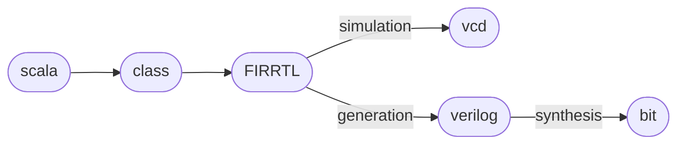

## Verilog 生成
```scala
object Hello extends App {
	emitVerilog(new Hello())
}

// generate to sub dir /generated
object Hello extends App {
	emitVerilog(new Hello(), Array("--target-dir", "generated"))
}

// print to console
object Hello extends App {
	val s = getVerilogString(new Hello())
	println(s)
}
```
## Chisel 工作流


## Chisel Test
关系：Chisel Test是Scala Test的扩展
Scala Test 测试：
```scala
import org.scalatest._
import org.scalatest.flatspec.AnyFlatSpec
import org.scalatest.matchers.should.Matchers

class ExampleTest extends AnyFlatSpec with Matchers {
	"Integers" should "add" in {
		val i = 2
		val j = 3
		i + j should be (5)
	}

	"Integers" should "multiply" in {
		val a = 3
		val b = 4
		a * b should be (12)
	}
}
```
Chisel Test 测试：
```scala
import chisel3._
import chiseltest._
import org.scalatest.flatspec.AnyFlatSpec

class DeviceUnderTest extends Module {
	val io = IO(new Bundle {
		val a = Input(UInt(2.W))
		val b = Input(UInt(2.W))
		val out = Output(UInt(2.W))
		val equ = Output(Bool())
	})

	io.out := io.a & io.b
	io.equ := io.a === io.b
}

class SimpleTest extends AnyFlatSpec with ChiselScalatestTester {
	"DUT" should "pass" in {
		test(new DeviceUnderTest) { dut =>
			dut.io.a.poke(0.U)
			dut.io.b.poke(1.U)
			dut.clock.step()
			println("Result is: " + dut.io.out.peekInt())
			dut.io.out.expect(0.U)
			
			val res = dut.io.out.peekInt()
			assert(res == 0)
			val equ = dut.io.equ.peekBoolean()
			assert(!equ)
			
			dut.io.a.poke(3.U)
			dut.io.b.poke(2.U)
			dut.clock.step()
			println("Result is: " + dut.io.out.peekInt())
			dut.io.out.expect(2.U)
		}
	}
}
```

+ 输入数据：`poke`
+ 读取输出：`peekInt`, `peekBoolean`
	+ `peek`返回Chisel类型，`peekInt`返回Scala BigInt
+ 时钟前进：`clock.step()` 默认一周期
+ 结果验证：`expect`

### 波形
```scala
class SimpleTest extends AnyFlatSpec with ChiselScalatestTester {
	"WaveformCounter" should "pass" in {
		test(new DeviceUnderTest)
			.withAnnotations(Seq(WriteVcdAnnotation)) { dut =>
			for (a <- 0 until 4) {
				for (b <- 0 until 4) {
					dut.io.a.poke(a.U)
					dut.io.b.poke(b.U)
					dut.clock.step()
				}
			}
		}
	}
}
```
### printf
模块内嵌`printf`，上升沿触发
```scala
class DeviceUnderTestPrintf extends Module {
		val io = IO(new Bundle {
		val a = Input(UInt(2.W))
		val b = Input(UInt(2.W))
		val out = Output(UInt(2.W))
	})

	io.out := io.a & io.b
	printf("dut: %d %d %d\n", io.a, io.b, io.out)
}
```
