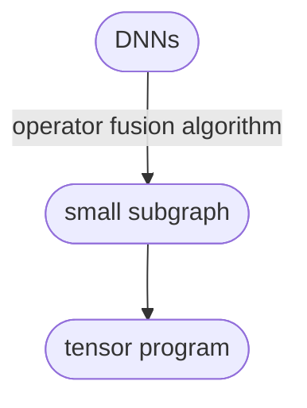
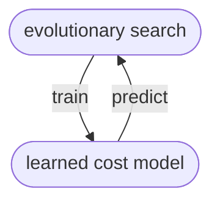

> [!info]
> Link: [OSDI](https://www.usenix.org/system/files/osdi20-zheng.pdf) [arxiv](http://arxiv.org/abs/2006.06762)
> Code: Github ([Cpp](https://github.com/apache/tvm/tree/main/src/auto_scheduler) | [Python](https://github.com/apache/tvm/tree/main/python/tvm/auto_scheduler))

## 摘要&结论
动机：

+ 当前高性能张量程序往往由<u>供应商提供</u>或依赖于<u>各种搜索策略</u>
	+ 需要大量工作来实现针对某一平台的优化
	+ 由于搜索空间受限、搜索策略低效而无法找到高性能程序

思想：

+ 高效探索<u>大搜索空间</u>
+ 优先考虑<u>性能瓶颈</u>

方法：

+ 探索更多更优组合：从<u>搜索空间的层次表示</u>上采样程序
+ fine-tune采样程序：使用<u>进化搜索</u>(evolutionary search)和习得的<u>开销模型</u>(learned cost model)识别最优程序
	+ 能够找到现有SOTA搜索空间外的高性能程序
+ 利用<u>任务调度</u>同时优化DNN的多个子图

局限：

+ 无法优化动态计算图
	+ Ansor要求计算图形状静态且已知
	+ TODO: 符号或动态形状的程序生成
+ 仅支持稠密操作
	+ TODO: 重新设计搜索空间
+ 仅在high level进行程序优化，依赖其他代码生成(如LLVM)做针对不同平台的优化
	+ Ansor未能利用不同平台的特殊指令

相关工作：

 + 基于调度语言的张量程序生成
 + 多面体编译模型
 + DL的图级别优化
 + 基于搜索的编译与自动调优

结论：

+ Ansor搜索空间更大，搜索时间更短(时间比SOTA少一个数量级)
+ 仅需修改数学定义，便可自动扩展至新算子
## 引言
> [!info] 计算图
> DNN可表为DAG
> 
> + 节点：算子(如卷积、矩阵乘)
> + 有向边：算子依赖关系

DNN平台部署流程：

基于搜索的张量程序(张量算子的low-level实现)编译生成

+ 流程：
	1. 使用high-level命令式语言定义计算
		+ 定义张量形状，输出张量的每个元素如何计算
	2. 编译器根据特定硬件平台进行搜索，生成优化后的张量程序
+ 要点：探索能囊括所有有用张量程序优化的足够大的搜索空间
	+ 问题： 
		1. 基于<u>预定义</u>的手写模版
		2. 仅<u>评估部分程序</u>便进行的激进剪枝
	+ 解决：
		1. 自动生成全面覆盖所有优化的大搜索空间
		2. 给每个张量程序一次被选中的机会
+ 挑战：
	1. 对于给定计算定义，需<u>自动生成尽可能大的搜索空间</u>
	2. 在<u>不比较不完整程序的前提下高效搜索超大搜索空间</u>，其大小比现有模版所覆盖的空间大几个数量级 
	3. 优化具有多个子图的整个DNN时，需<u>识别端到端性能中的关键子图</u>并优先处理 

Ansor: 深度学习应用的张量程序生成(自动搜索)框架

+ 利用<u>层级表示</u>覆盖大搜索空间
	+ 解偶high-level结构和low-level细节
	+ high-level灵活枚举，low-level高效采样 
+ 先在层级表示上<u>采样</u>完整程序，再使用进化搜索和习得开销模型对程序进行<u>调优</u>
+ <u>动态优先考虑</u>能提升端到端性能的DNN子图
	+ 使用基于<u>梯度下降</u>的调度算法优先考虑重要子图

## 背景
> [!faq] high-level VS low-level
> high-level: 程序的结构
> low-level: tile大小，展开系数 

张量应用搜索策略：


+ 模版引导搜索：使用<u>手工模版</u>定义搜索空间，对于给定输入形状和特定硬件搜索最优参数
	+ 模版：张量程序结构 + 可调参数
	+ 缺陷：
		+ 开发模版需要大量工作
		+ 制作高质量模版需要同时精通算子和硬件
		+ 手工模版不可能涵盖所有算子，只能覆盖有限的程序结构 
			+ FlexTensor提供支持多种算子的通用模版，但该模版<u>仅支持单算子粒度</u>，不支持融合算子等涉及多算子的优化
		+ 手工模版无法进行重建，无法为同一算子生成不同结构
			+ 具有多算子的计算图搜索空间需包含<u>构建同一算子的不同方式</u>
+ 基于顺序构造搜索：将张量程序的构造<u>分解</u>为一系列顺序决策(使用beam search/auto-scheduler决策)
	+ 方法：
		+ 使用一系列通用展开规则，顺序展开计算图中的所有节点
		+ 由于潜在决策量庞大，每次决策后使用习得价值模型进行评估，仅保留top-k
	+ 缺陷：
		+ 搜索过程中候选程序<u>不完整</u>，在<u>完整程序上训练</u>得到的开销模型不能准确评估非完整程序的最终性能
		+ <u>固定的展开顺序</u>限制了搜索空间的设计，而某些优化需要向计算图中新增节点(如cache节点) 
		+ 不同程序的<u>决策数不同</u>，难以对齐不完整程序以进行比较
		+ <u>不可扩展</u>，累计误差随着顺序构造步数的增加而增长
+ Ansor层级化搜索：使用层次化搜索空间<u>解偶</u>high-level结构和low-level细节
	+ 优势：
		+ <u>自动构建</u>搜索空间，无需手动开发模版
		+ 采样<u>完整程序</u>，避免非精确估计

## 算法


输入：一组待优化的DNN

输出：为计算图子图生成的张量程序

流程：


组成：

+ 程序采样器：在设计空间中<u>随机采样</u>以提供搜索空间的<u>全面覆盖</u>
	+ 层级表示：
		+ 草图(sketch)：high-level程序结构
		+ 标注(annotation)：low-level实现选择(如tile size, parallel, unroll annotations)
+ 性能调优器：采样得到的程序性能较差，使用<u>迭代式</u>进化搜索和习得开销函数进行调优
	+ 迭代策略：使用<u>新采样的程序</u>和<u>往期迭代中的好程序</u>做基因突变和交叉互换
		+ 杂交过程中<u>乱序</u>写回，解决顺序构造的局限性
	+ 效率提升：<u>查询习得开销模型</u>而不是实际运行测量，速度提升几个数量级
+ 任务调度器：调度多个子图优化过程中的时间分配，使用<u>基于梯度下降的调度算法</u>
	+ 问题：将整个DNN视作完整的计算图可能会得到最优性能，但引入了<u>不必要的搜索空间指数爆炸</u>
	+ 解决：编译器往往将DNN的大计算图划分为几个子图
		+ 由于 ==DNN的分层结构==，子图划分对DNN优化的影响微乎其微
	+ 方法：优先调度为DNN端到端性能最有可能带来提升的子图的优化任务
### 程序采样
> [!quote] 搜索空间的重要性
> The search space an algorithm explores determines the best programs it can find.

现有算法搜索空间限制与解决：

+ 手动<u>枚举</u>：不可能以模版形式枚举所有可能选择
	+ 通过<u>递归</u>使用一组灵活的<u>推导规则</u>自动展开搜索空间
+ 激进地提前<u>剪枝</u>：剪枝将阻止搜索算法探索空间中的特定区域
	+ <u>随机采样</u>完整程序：每点被采样的概率相等，从而算法可以潜在地探索空间中的每一个程序(不直接依赖随机采样结果寻找最优程序)


#### 草图生成
输入：划分后的子图

+ 等价形式：数学表达式，直接展开循环指标的朴素程序，相应的计算图 

输出：一系列草图

思想：对节点分类讨论

+ 计算节点：tile, 融合
+ 简单元素操作节点：内联
+ 新增节点：cache, 层变换等客制化节点

状态定义：$\sigma=(S,i)$

+ S: 当前部分生成的草图
+ i: 当前正在处理的节点编号

流程：

1. 对DAG做<u>拓扑排序</u>，按序为每个节点打上编号
2. 初态$\sigma_0=(\emptyset,\text{index of the last node})$
3. 递归使用推导规则：
	+ <u>静态确定</u>推导规则谓词取值(通过解析数学表达式的输入/输出模式)
	+ 对每一条符合的推导规则
		+ 推导：$\sigma=(S,i)\to\sigma'=(S',i'),\ i'\leqslant i$
		+ 将中间结果入队
	+ 边界：$i=0$，终态
4. 所有终态$\sigma.S$即为所有生成草图(往往<10个)

> [!faq] space VS reduction
> space: 计算输出的维度，用于计算空间的遍历
> reduction: 计算后不存在的维度，用于元素的聚合

推导规则：


+ 谓词：
	+ `IsStrictInlinable(S, i)`: i是简单的元素操作，可内联(如加法, ReLU)
	+ `HasDataReuse(S, i)`: i是计算密集节点，算子内存在大量数据重用机会(如matmul, conv2d)
	+ `HasFusibleConsumer(S, i)`: i只有一个后继j，且j可与i融合(如matmul+bias_add, conv2d+relu)
	+ `HasMoreReductionParallel(S, i)`: i在约化维有充分并行机会(大量数据->少量数据，如2-norm, 不规则矩阵乘)
+ 规则：
	+ Rule 1, 2: 内联处理
		+ 不可内联->跳过，可内联->内联
	+ Rule 3, 4, 5: 多级tiling, 融合
		+ Rule 3: 多级tiling以重用数据
			+ 记号: S: Space loop, R: Reduction loop
			+ CPU: SSRSRS
				+ 例：$C(i,j)=\sum_kA[i,k]\times B[k,j]\to(i_0,j_0,i_1,j_1,k_0,i_2,j_2,k_1,i_3,j_3)$
				+ 可重排：令循环长度=1
				+ 通用：==深度学习中的计算密集算子都由space loop和reduction loop组成==
			+ GPU：SSSRRSRS
				+ 前三个空间维度与BlockIdx, 虚拟线程, ThreadIdx绑定
		+ Rule 4: 多级tiling并融合后继
		+ Rule 5: 若当前数据重用节点无可融合后继，将数据缓存起来，以便后续使用或写回主存
			+ 添加Cache节点后，Cache节点可与该节点融合(Rule 4)，效果为该节点的计算结果将写入Cache中
	+ Rule 6: 约化维处理，使用rfactor将reduction loop分解为space loop
	+ 扩展：为客制化算子<u>添加新的推导规则</u>，与现有规则无缝整合
		+ GPU: 增加2条推导规则
			1. 插入Cache节点以利用共享内存(Rule 5)
			2. 线程协作约化(cross-thread reduction)(Rule 6)

> [!example]
> ```mermaid
> graph LR;
> A((A))-->C(("C<br>GEMM(A,B)"))
> B((B))-->C
> C-->D(("D<br>ReLU(C)"))
> ```
> 
> ReLU操作`D[i, j] = max(C[i, j], 0.0)`需`C[i, j]`计算完毕后才知道结果，故无法内联；而只要一个`C[i, j]`计算完毕，`D[i, j]`便可开始计算，无需等待所有`C[i, j]`均计算完毕，故二者可融合

#### 随机标注 
流程：向草图添加tile大小和循环标记(parallel, unroll, vectorization) 

+ 随机填写<u>tile大小</u>
+ <u>并行化</u>外部循环
+ <u>展开</u>内部循环
+ 随机改变计算图中部分节点的<u>计算位置</u>以微调计算图结构

> 长度为1的循环将被简化

随机：在所有合法值上<u>按均匀分布进行采样</u>

+ 客制化标注：提供采样hint以调整策略
+ 常量张量处理：根据多级tile结构<u>改变常量张量的计算布局</u>，使得其更加cache-friendly

### 性能调优
问题：采样得到的程序很好的覆盖了搜索空间，但<u>优化选择(tile结构，循环标注)是随机采样</u>的

流程：



+ 使用进化搜索寻找一小批promising的程序
	+ 使用开销模型预测程序的适应度
+ 运行这些程序并测量真机时间
+ 使用profile得到的数据重新训练开销模型

> [!faq] 使用开销模型的原因
> 开销模型可以给出<u>对程序适应度相对精确的估计</u>，同时<u>比实际测量快</u>几个数量级，可以<u>快速</u>比较搜索空间中成百上千的程序
#### 进化搜索
基因：程序从朴素实现到当前状态的改写步骤

+ 在草图生成和随机标注的同时维护改写的历史
+ 描述了程序如何从初始的朴素实现形成的

突变规则：与的决策相对应

+ Tile大小突变：找到tile循环，给一个tile级别除一个factor，乘到另一个tile级别上(保证tile大小乘积不变，程序始终合法)
+ 并行突变：找到parallel标注循环，通过和邻近循环融合或拆分改变并行粒度
+ Pragma突变：改变针对编译器的编译优化指令
	+ 例：使用pragma实现循环展开，`auto_unroll_max_step=N` 随机改变N的值
+ 计算位置突变：选择计算图中非多级tile的灵活节点(如卷积的padding节点)，随机改变该计算节点的位置(保证合法)

流程：

1. 初始化：采样得到初代程序
2. 自然选择：
	+ 每个程序<u>被选择留下的概率</u>正比于习得价值模型给出的适应性预测
	+ 性能越高的程序，越有可能留下
3. 基因突变：随机作用一个突变规则得到新程序
4. <u>基于节点的</u>自由组合：融合两个现有程序的改写步骤
	+ 问题：直接融合修改步骤可能破坏数据依赖关系，导致程序非法
		+ 解决：由于DAG不同节点的改写步骤依赖关系小，以DAG节点为粒度实施自由组合
	+ 操作：对每一个节点，随机选择父本或母本，融合不同节点的重写步骤
		+ 对于存在依赖的节点，使用启发式方法分析并调整合并步骤
		+ 验证合并后的程序的功能是否正确
			+ 框架依赖的code generator可通过<u>依赖分析</u>校验正确性
5. 模型训练：进化几个世代后，输出小部分最高分程序的集合；编译运行，测量真机运行时间，使用收集的数据<u>更新模型</u>
	+ 开销模型的精度逐渐提升，进化搜索逐渐生成高质量程序
> [!example] 自由组合示例
> 

优势：

+ 为张量程序特别设计的进化操作
+ 可对程序进行乱序修改

#### 习得开销模型
优势：

+ 可移植性强：硬件改变时，仅需给模型喂不同训练数据

目的：预测最内层的非循环语句执行效率

+ <u>优化对象</u>是数据并行的张量程序，由多重交织循环和几个最内层的赋值语句组成
+ 对于完整的程序，将所有内层语句的打分相加 

模型：Xgboost

特征提取：在<u>整个程序的上下文</u>提取最内层非循环语句的特征向量

+ 特征：类型特征(采用独热编码表示)、数值特征，2类共164维
	+ 浮点操作个数
	+ 整数操作个数
	+ 向量化相关特征
	+ 循环展开相关特征
	+ 并行化相关特征
	+ GPU线程绑定相关特征
	+ 运算强度(操作数/访存数)曲线：插值、采样
	+ buffer访存特征
	+ 内存分配相关特征
	+ 其他特征：外层循环数，外层循环长度乘积，`auto_unroll_max_step`个数

> [!note]  Throughput
> 程序单位时间执行的计算量

损失函数：加权平方误差

$$
\text{loss}(f,P,y)=y(\sum_{s\in S(P)}f(s)-y)^2
$$

+ 符号：
	+ $f$: 模型
	+ $P$: 程序
	+ $y$: 程序吞吐量
	+ $S(P)$: 内层语句集合
+ 由于目的是找到高性能程序，给予高性能程序以高权重，故直接<u>使用程序吞吐量作为权重</u>

模型迁移：

+ 单个模型可用于所有DAG生成的所有程序，故对同一DAG生成的程序做归一化
+ 由于优化DNN时，被测程序数量往往少于30000，在小规模数据集上训练Xgboost很快，故<u>每次优化时都训练新模型</u>，而不是采用增量更新

### 任务调度
优化某些子图并不会显著提高端到端性能

+ 该子图不是性能瓶颈
+ 微调该子图收效甚微

概念：

+ (一个)任务：为(一个)子图生成高性能程序
+ 一单位时间资源：一个子图的一次进化迭代

#### 形式化表达
优化目标：

+ 降低单DNN延迟
+ 将一组DNN优化至满足延迟要求
+ 单DNN性能提升不明显时最小化调优时间 

方法：使用目标函数表达优化目标

优化目标：

$$
\text{minimize}\ f(g_1(t),g_2(t),\cdots,g_n(t))
$$

+ 符号：
	+ $n$: 任务总数
	+ $t\in Z^n$: 时间分配向量
	+ $t_i$: 为任务$i$分配的时间资源单位数
	+ $g_i(t)$: 在分配$t$下任务$i$对应的子图$g_i$能优化达到的最低计算延迟
	+ $f$: 端到端开销
	+ $w_i$: 任务$i$在DNN中出现的次数
	+ $m$: DNN总数
	+ $S(j)$: DNN$_j$任务集合
	+ $L_j$: DNN$_j$的延迟要求(即要求将DNN的延迟优化至$\leqslant L_j$)
	+ $B_j$: DNN$_j$的参考延迟
	+ $ES(g_i,t)$: 子图$g_i$的提前停止延迟(即当子图计算时间被优化至$ES$时停止优化，根据延迟的<u>历史数据</u>确定优化边界)
+ 目标函数：
	+ $f_0=\sum_{i\in S(j)}w_i\times g_i(t)$
		+ 单DNN端到端延迟
	+ $f_1=\sum_{j=1}^m\sum_{i\in S(j)}w_i\times g_i(t)$
		+ 多DNN顺序执行一次的端到端延迟
	+ $f_2=\sum_{j=1}^m\max(\sum_{i\in S(j)}w_i\times g_i(t),L_j)$
		+ 当DNN$_j$满足延迟要求后，不再优化
	+ $f_3=-\left(\prod_{j=1}^m\dfrac{B_j}{\sum_{i\in S(j)}w_i\times g_i(t)}\right)^{1/m}$
		+ 最大化每个DNN加速比的几何平均
	+ $f_4=\sum_{j=1}^m\sum_{i\in S(j)}w_i\times\max(g_i(t),ES(g_i,t))$
		+ 每个任务均可提前停止

#### 梯度下降优化
思想：每次选择投入时间能获得最大收益的task$_i$，为之分配1份的时间

$$
i=\mathop{\arg\!\max}_i\left|\dfrac{\partial f}{\partial t_i}\right|
$$

梯度估计：

1. $g_i(t)\approx g_i(t_i)$近似
	+ 认为$g_i(t)$仅与分配给它的时间$t_i$有关
	+ 因为<u>开销模型训练</u>时所有$t$对模型产生影响，$g_i(t)$由模型得到，故与所有$t$有关
2. $f(x)=\alpha f'_+(x)+(1-\alpha)f'_-(x)+o(1)$
	+ 使用微分的定义证明
	+ $g_i(t_i),g_i(t_i-\Delta t)$已知(逐次迭代优化)，使用$\alpha$控制历史数据使用权重($\Delta t$为向后看的窗口大小)
3. $(g_i(t_i+\Delta t)-g_i(t_i))/\Delta t\approx g_i(t_i+1)-g_i(t_i)$
	+ 时间单元分配粒度为1
4. $g_i(t_i+1)$估计：
	+ 乐观估计：认为$g_i$优化后性能提升速率不变，即再投入一份时间，能优化$g_i(t_i)/t_i$
	+ 结构相似的子图计算速度类似：
		+ 设$N(i)$为与任务$i$结构相似的任务集合，$V_k$为任务$k$的计算速度(flop数)，$C_i$为为任务$i$的计算量(浮点计算数)
		+ 则估计为$C_i/\max_{k\in N(i)}V_k$，认为达到了相似子图中最快的计算速度
	+ 乐观估计，取二者最小值
	+ 使用$\beta$控制相似性预测的信任权重

$$
\dfrac{\partial f}{\partial t_i}\approx \dfrac{\partial f}{\partial g_i}\left(\alpha\dfrac{g_i(t_i)-g_i(t_i-\Delta t)}{\Delta t}+(1-\alpha)\left(\min\left(-\dfrac{g_i(t_i)}{t_i},\beta\dfrac{C_i}{\max_{k\in N(i)}V_k}-g_i(t_i)\right)\right)\right)
$$

流程：

1. 初识化：$t=0$
2. round-robin(为每个子图分配同等的时间)热身，得到初始分配$t=(1,1,\cdots,1)$
3. 每一轮迭代，计算梯度，选取$i=\mathop{\arg\!\max}_i\left|\dfrac{\partial f}{\partial t_i}\right|$，为任务$i$分配一份资源，更新$t_i\leftarrow t_i+1$
	+ 选择任务时采取$\epsilon$-贪心策略
4. 直到时间预算分配完毕

## 实验
#### 单算子Benchmark
Workload: 1D/2D/3D卷积(C1D, C2D, C3D)，矩阵乘法(GMM)，分组卷积(GRP)，膨胀卷积(DIL)，深度卷积(DEP)，反向卷积(T2D)，胶囊2D卷积(CAP)，矩阵二范数(NRM)

实验方法：允许每个框架对每个程序实际测量至多1000次

归一化：

+ 同一算子吞吐量求几何平均
+ 按照性能最高者归一化


结论：

+ Ansor性能始终最高：搜索空间大，探索效率高
+ NRM性能提升显著：Ansor对约化维度做并行
+ T2D性能提升显著：Ansor使用正确的tile结构和展开策略，让code generator简化了0的乘法 
+ Halide GMM, C2D性能较差：当padding在约化循环外做时，未划分约化循环
+ AutoTVM性能较差：tile结构有限
+ FlexTensor性能较差：无法改变padding的计算位置，模版无法对NRM的约化操作奏效

消融研究：

+ 研究对象：ResNet-50(batch=16)最后一个卷积算子
+ 测定：运行5次取中位数
+ 变体：
	+ Beam Search: 使用开销模型评估剪枝非完整程序且不做fine-tuning
	+ No fine-tuning: 仅依赖随机采样
	+ Limited Space: 将搜索空间限制在手工模版类似的大小
	
+ 结论：
	+ 缩减搜索空间、减少高效fine-tuning严重降低最终性能
	+ 激进地提前剪枝由于对程序最终性能的错误估计而丢弃高性能的好程序

#### 子图Benchmark
Workload: 卷积层ConvLayer(2D卷积+批归一化+ReLU激活)，Transform块层TBS(2x矩阵转置+批矩阵乘+softmax)


结论：

+ Ansor性能始终最高
+ FlexTensor对子图优化优势不明显：缺乏融合算子支持

#### 端到端Benchmark
Workload: ResNet-50, MobileNet-V2, 3D-ResNet-18, DCGAN, BERT

优化目标：优化各个DNN的计算延迟


结论：

+ Ansor性能最优
+ DCGAN加速明显：DCGAN主要由T2D构成，而Ansor对T2D优化较好
+ AutoTVM对ResNet-50在Intel CPU上优化较好：2D卷积模版性能好，且有<u>全局布局搜索</u>
+ Ansor对优化<u>非常规阵</u>和<u>小batch</u>优化效果好

消融研究：

+ 优化目标：对AutoTVM有最大加速比
+ 变体：
	+ No task scheduler: 使用round-robin策略，为每个子图分配相同的时间资源
	
+ 结论：
	+ 最优程序不在限制的搜索空间中
	+ 随机采样微调但不调度能打败AutoTVM
	+ Ansor性能最强：使用task schedule优先处理性能瓶颈(如含3x3卷积的子图)，搜索效率高

#### 搜索时间
指标：

+ 测量次数：与测量的实现和搜索算法的开销无关
+ 挂钟时间：考虑所有因素


结论：

+ 搜索时间的节省来源于任务调度，高效fine-tuning和对高效优化的全覆盖
+ 这些额外操作并没有带来额外的开销，且有更好的测量实现

#### 开销模型


结论：

+ 在$y=x$附近分布，模型准确性高
+ 模型倾向于测量高性能的程序
